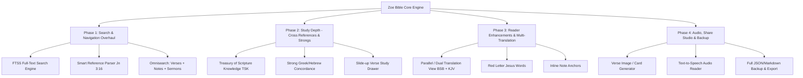

# Zoe Bible — Competitive Research & Comprehensive App Improvement Plan

---

## Executive Summary

The digital Bible ecosystem is one of the most engaged categories in mobile applications, with top apps like **YouVersion** exceeding 600+ million downloads and specialized apps like **Logos**, **Blue Letter Bible**, and **Dwell** commanding dedicated, daily-active user bases.

This document presents:
1. **In-depth competitive research** on the most successful, popularly used Bible apps.
2. **Data sources & licensing breakdown** (where top apps get translations, commentaries, original language lexicons, audio, and cross-references).
3. **Core & advanced feature teardowns** that drive retention, engagement, and study depth.
4. **Current state audit of Zoe Bible** against industry standards.
5. **Actionable, phased roadmap and architectural plan** to transform Zoe Bible into a premier, modern Bible application.

---

## 1. Competitive Analysis: Popular & Successful Bible Apps

### A. Top Tier Apps Benchmark

| App | Primary Focus & Audience | Key Differentiators | Retention Drivers |
| :--- | :--- | :--- | :--- |
| **YouVersion (Bible.com)** | Broad mainstream audience, daily devotionals, global languages | 3,000+ versions in 2,000+ languages, social streaks, "Plans with Friends", Audio Bibles, Verse of the Day Stories | Push notifications, streak badges, community reading plans, home screen widgets |
| **Blue Letter Bible (BLB)** | Serious students, pastors, expository teachers | Deep Strong’s Concordance integration, interlinear Hebrew/Greek, classic public domain commentaries (Henry, Spurgeon, Barnes) | Indispensable tool for verse-by-verse study and original language research |
| **Logos Bible Software** | Academics, theologians, seminary students, pastors | Massive theological library integration, reverse interlinears, semantic tagging, sermon builder | Professional desktop-to-mobile sync, proprietary data graphs |
| **Dwell Audio Bible** | Audio-first listeners, meditation, memorization | Multiple voice actors & ambient music options, repeat/sleep timer, listening plans | Daily listening habits, commute listening, premium audio aesthetic |
| **Catena Bible** | Early church history, patristics, Catholic/Orthodox/Anglican | Verse-by-verse commentary from early Church Fathers (Augustine, Chrysostom, Aquinas) | Unique historical depth not found in evangelical-focused apps |
| **Step Bible (Tyndale House)** | Academic/rigorous word studies | Open-access lexical analysis, morphological tagging, translation comparison | High scholarly authority, completely free and open |
| **Olive Tree Bible Study** | Hybrid reader + digital library | Resource Guide panel that auto-scrolls commentaries and dictionaries alongside scripture | Split-screen workflow and offline library management |

---

## 2. Where Top Apps Get Their Data: Sources & Licensing

A critical foundation of any Bible app is its data pipeline. Understanding how data is sourced, stored, and licensed is key to expanding Zoe Bible sustainably.

### A. Bible Text Translations

```
                             ┌───────────────────────────────────────┐
                             │       Bible Translation Data          │
                             └──────────────────┬────────────────────┘
                                                │
                 ┌──────────────────────────────┴──────────────────────────────┐
                 ▼                                                             ▼
  ┌──────────────────────────────┐                             ┌──────────────────────────────┐
  │   Public Domain & Open       │                             │   Licensed / Copyrighted     │
  │   (No Royalties / Free)      │                             │   (Agreements / Royalties)   │
  ├──────────────────────────────┤                             ├──────────────────────────────┤
  │ • Berean Standard Bible (BSB)│                             │ • ESV (Crossway / API)       │
  │ • King James Version (KJV)   │                             │ • NIV / NLT (Biblica/Tyndale)│
  │ • World English Bible (WEB)  │                             │ • CSB (Lifeway/B&H)          │
  │ • Young's Literal (YLT)      │                             │ • NASB (Lockman Foundation)  │
  │ • American Standard (ASV)    │                             │ • API.Bible (Digital Bible)  │
  └──────────────────────────────┘                             └──────────────────────────────┘
```

1. **Open & Permissive Translations (Ideal for Zoe Bible's Offline SQLite DB):**
   * **Berean Standard Bible (BSB):** Fully open (CC0 / Public Domain dedication as of 2023). High readability, modern English, excellent scholarship. *Already utilized in Zoe Bible!*
   * **World English Bible (WEB):** 100% Public Domain modern English translation. Includes Apocrypha/Deuterocanon.
   * **King James Version (KJV) & American Standard (ASV):** Public domain worldwide (except crown copyright in UK for KJV).
   * **NetBible (NET):** Ministry-friendly free digital license with 60,000+ translator notes.

2. **Copyrighted / Modern Translations (Licensing Requirements):**
   * **API.Bible (Digital Bible Platform by American Bible Society):** Provides REST API access to hundreds of Bible versions for non-commercial/registered developers.
   * **Crossway API:** Free API tier for non-commercial ESV integration.
   * **Commercial Publisher Direct Licensing:** HarperCollins Christian (NIV), Tyndale (NLT), Lockman (NASB). Typically requires 5–10% royalty or minimum annual guarantee.

### B. Study Aids, Original Languages & Commentaries

1. **Treasury of Scripture Knowledge (TSK):**
   * Over **500,000 cross-references** connecting verses across the entire Bible canon.
   * Public domain, freely available in SQLite / JSON datasets on GitHub (`scrollmapper/bible_databases`, `STEPBible-Data`).
2. **Strong's Concordance & Hebrew/Greek Lexicons:**
   * Strong's Exhaustive Concordance numbers (H1–H8674 for Hebrew, G1–G5624 for Greek).
   * Thayer's Greek Lexicon & Brown-Driver-Briggs (BDB) Hebrew Lexicon (Public Domain).
   * Free open datasets: **STEPBible** (Tyndale House Cambridge) provides permissive Creative Commons datasets with morphological tagging and word alignments.
3. **Public Domain Verse-by-Verse Commentaries:**
   * Matthew Henry’s Complete Commentary, Charles Spurgeon’s Treasury of David (Psalms), Jamieson-Fausset-Brown Commentary, Albert Barnes’ Notes on the Bible, John Gill’s Exposition.
4. **Church Fathers / Historical Commentaries (Catena data):**
   * Philip Schaff's *Nicene and Post-Nicene Fathers* (38 volumes, Public Domain).

### C. Audio Bibles

* **Public Domain / Open Audio:** LibriVox recordings (KJV, ASV), Berean Study Bible audio recordings, Faith Comes By Hearing (Audio Bible API / DBP).

---

## 3. High-Impact Features of Successful Bible Apps

```
┌──────────────────────────────────────────────────────────────────────────────────┐
│                             FEATURE SPECTRUM                                     │
├──────────────────────┬─────────────────────────────┬─────────────────────────────┤
│   1. Core Reading    │    2. Study & Depth         │   3. Habit & Engagement     │
├──────────────────────┼─────────────────────────────┼─────────────────────────────┤
│ • Parallel / Split   │ • Cross-Reference Drawer    │ • Daily Streaks & Badges    │
│ • Custom Typography  │ • Strong's Interlinear Tap  │ • Home Screen Widgets       │
│ • Offline Fast FTS5  │ • Verse-by-verse Commentary │ • Audio Narration & Sync    │
│ • Red Letter (Jesus) │ • Topic / Theme Index       │ • Shareable Verse Images    │
│ • Smart Search & Ref │ • Sermon/Note Workspace     │ • Reading Plans with Alerts │
└──────────────────────┴─────────────────────────────┴─────────────────────────────┘
```

### 1. The Study Engine (Why Users Return to Study)
* **Instant Interlinear / Word Study:** Tapping any English word reveals its original Greek/Hebrew lemma, pronunciation, Strong's number, root definition, and occurrences across the Bible.
* **Cross-Reference Matrix (TSK):** When reading Romans 8:28, a single swipe displays connected verses across Genesis, Psalms, and Ephesians.
* **Parallel / Split Reader:** Side-by-side or stacked comparative reading (e.g., BSB alongside KJV or Greek/Hebrew text).
* **Multi-Layer Annotations:** Differentiating between *Highlighting* (color), *Bookmarking* (saving place), *Tags* (#faith, #comfort), and *Deep Notes*.

### 2. Habit Formation & Daily Devotion (Why Users Open the App Every Day)
* **Home Screen Widgets (iOS & Android):** Daily verse widget, reading plan streak widget, and quick-note shortcut.
* **Smart Notifications:** Customizable morning/evening devotional reminders that respect user schedule.
* **Visual Verse Card / Image Generator:** Beautiful canvas tool allowing users to format a verse over photography or solid minimalism to share on Instagram/WhatsApp.
* **Gamification with Reverence:** Streak counters with freeze days, completion milestones, and reading stats (% of Bible read, books completed).

### 3. Productivity & Pastoral Tools (Why Leaders Use the App)
* **Sermon Note Taker with Scripture Embeds:** Typing `@John 3:16` or selecting text in reader automatically embeds the full verse inside the note.
* **Export & Backup:** PDF, Markdown, and JSON export for personal study notes. Cloud sync (Google Drive / iCloud / local export).

---

## 4. Current State Assessment of Zoe Bible

### Current Strengths
- Clean, minimalist aesthetic with custom modern typography (*Syne*, *Lora*, *DM Sans*).
- Offline-first architecture with pre-bundled SQLite database (`BSB.db`).
- Dedicated Sermon/Session organizer (`app/(tabs)/session.tsx`).
- Reading plans with custom plan generator (`app/plan/create.tsx`).
- Responsive theme support (Dark/Light).

### Gaps vs. Industry Standards

| Feature Area | Zoe Bible Current State | Industry Best Practice |
| :--- | :--- | :--- |
| **Search Engine** | Basic SQL `LIKE '%...%'` scan; 0 results for reference queries like `Jn 3:16`. | SQLite **FTS5** full-text search with Porter stemming, BM25 ranking, reference parser, and facet filters. |
| **Study Aids** | No cross-references, Strong's numbers, or commentaries. | Slide-up sheet with TSK cross-references and Strong's lexicon definition on verse tap. |
| **Multi-Translation** | Single translation (BSB). | Multiple offline public-domain translations (BSB + KJV + WEB) with parallel view. |
| **Verse Interaction** | Basic highlight/note popup. | Action bar: Highlight, Note, Bookmark, Cross-Refs, Copy, Audio, Share Image. |
| **Audio** | No audio support. | Native Text-To-Speech (TTS) or streamed/downloaded audio narration with word sync. |
| **Home Screen & Sharing** | Basic text share dialog. | Stylized Verse-of-the-Day image generator with customizable fonts and backgrounds. |
| **Data Backup** | Local SQLite on device only (data loss on app uninstall). | JSON / Markdown backup & restore to file system or cloud. |

---

## 5. Comprehensive Improvement Plan for Zoe Bible



---

## 6. Phased Implementation Roadmap

### 🚀 Phase 1: Smart Search & Navigation Overhaul (Immediate Priority)
* **Goal:** Transform search into an instantaneous, intelligent entry point.
1. **SQLite FTS5 Integration:**
   * Create `BSB_verses_fts` virtual table with `porter unicode61` tokenizer.
   * Enable prefix matching (`pray*`), exact phrase matching (`"holy spirit"`), and BM25 relevance sorting.
2. **Scripture Reference Resolver:**
   * Implement smart reference parser (`src/utils/referenceParser.ts`) to immediately handle inputs like `John 3:16`, `Ps 23`, `1 Cor 13:4-8` with a direct "Read Passage" action card.
3. **Omnisearch & Filter Chips:**
   * Add tabs to search across **Scripture**, **My Notes**, and **Sermon Sessions**.
   * Add filter chips for *Old Testament*, *New Testament*, *Gospels*, and *Epistles*.
4. **Live Debounced Search:**
   * 200–300ms debounce live search with clear highlighting.

### 📚 Phase 2: Study Engine & Cross-References (High Value)
* **Goal:** Give users deep Bible study capabilities without requiring internet access.
1. **Treasury of Scripture Knowledge (TSK) Integration:**
   * Bundle a compact, indexed SQLite table `cross_references (from_book, from_chap, from_verse, to_book, to_chap, to_verse)`.
   * When tapping a verse in the reader, show a bottom sheet with all associated cross-references.
2. **Strong’s Greek & Hebrew Lexicon Modal:**
   * Tap any verse or keyword to see original language definitions and Strong's root meanings.
3. **Verse Action Sheet:**
   * Clean bottom sheet containing: Highlight (6 colors), Bookmark, Add Note, Cross References, Copy, Share.

### 📖 Phase 3: Reader Enhancements & Multi-Translation (Core Experience)
* **Goal:** Modernize reading comfort and comparative study.
1. **Secondary Public Domain Translation (KJV & WEB):**
   * Allow users to download or bundle KJV / WEB for parallel split-view reading and translation comparison.
2. **Red Letter Formatting:**
   * Highlight words of Christ in subtle red (customizable in settings).
3. **Reader Customization:**
   * Adjustable line spacing, font family picker (Serif, Sans-serif, Dyslexic-friendly), and background themes (OLED Black, Warm Sepia, Crisp Light, Night Slate).
4. **Inline Note & Highlight Indicators:**
   * Show elegant margin badges where notes or bookmarks exist on a verse.

### 🎨 Phase 4: Share Studio, Audio & Data Safety (Retention & Growth)
* **Goal:** Expand organic sharing, accessibility, and user data security.
1. **Verse Image / Card Generator:**
   * Allow users to select 1–3 verses and export a stylized image with customizable typography, gradients, or background photos for sharing on social platforms.
2. **Audio Scripture (Offline TTS & Online Narration):**
   * Integrate `expo-speech` for offline chapter narration with playback speed controls (0.75x, 1.0x, 1.25x, 1.5x).
3. **Backup, Restore & Export:**
   * One-tap export of user data (notes, highlights, sermon sessions, reading plans) to JSON or human-readable Markdown files.
   * File import to restore user data seamlessly on new devices.
4. **Home Screen Widgets:**
   * Daily Verse and Reading Streak widget integration for iOS & Android.

---

## 7. Database Schema Expansion Plan

To support these advanced features while keeping the app fast and offline, the following schema additions will be introduced:

```sql
-- 1. Full-Text Search Virtual Table
CREATE VIRTUAL TABLE IF NOT EXISTS BSB_verses_fts USING fts5(
  book_id UNINDEXED,
  book_name UNINDEXED,
  chapter UNINDEXED,
  verse UNINDEXED,
  text,
  tokenize = 'porter unicode61'
);

-- 2. Cross References Table (TSK Data)
CREATE TABLE IF NOT EXISTS cross_references (
  id INTEGER PRIMARY KEY AUTOINCREMENT,
  from_book_id INTEGER NOT NULL,
  from_chapter INTEGER NOT NULL,
  from_verse INTEGER NOT NULL,
  to_book_id INTEGER NOT NULL,
  to_book_name TEXT NOT NULL,
  to_chapter INTEGER NOT NULL,
  to_verse INTEGER NOT NULL,
  votes INTEGER DEFAULT 0
);
CREATE INDEX IF NOT EXISTS idx_cross_ref ON cross_references(from_book_id, from_chapter, from_verse);

-- 3. Strong's Concordance Table
CREATE TABLE IF NOT EXISTS strongs_lexicon (
  strong_id TEXT PRIMARY KEY, -- e.g. 'G26' or 'H1254'
  language TEXT NOT NULL,     -- 'greek' or 'hebrew'
  lemma TEXT NOT NULL,        -- e.g. 'ἀγάπη'
  transliteration TEXT NOT NULL,
  pronunciation TEXT,
  definition TEXT NOT NULL,
  kjv_count INTEGER
);

-- 4. User Tags & Folders for Notes and Sessions
CREATE TABLE IF NOT EXISTS tags (
  id INTEGER PRIMARY KEY AUTOINCREMENT,
  name TEXT UNIQUE NOT NULL,
  color TEXT DEFAULT '#FF6B35'
);
```

---

## 8. Summary of Strategic Advantages for Zoe Bible

By implementing this roadmap, **Zoe Bible** will stand out uniquely in the market:
1. **100% Offline & Private:** Unlike cloud-reliant apps, all notes, reading plans, and study tools stay fast, private, and functional without cell reception.
2. **Exceptional Speed & Design:** A clutter-free, aesthetic UI built with React Native and modern typography, avoiding the dated interfaces of legacy study apps.
3. **From Reader to Serious Study:** Effortlessly bridging the gap between casual daily devotional reading and deep cross-referenced theological study.
